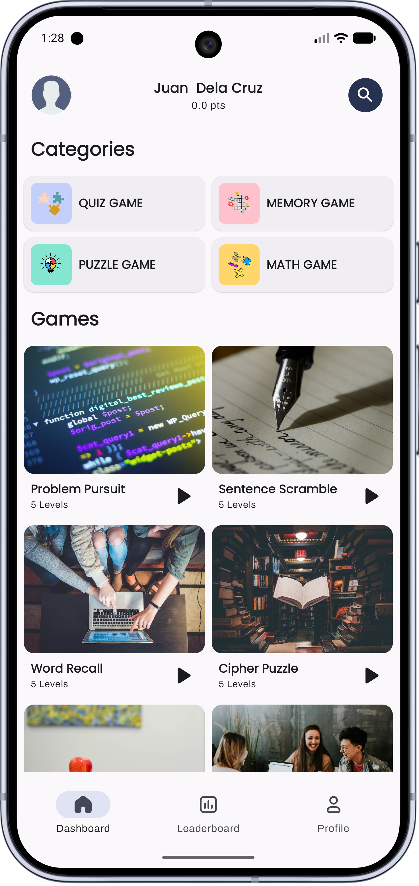
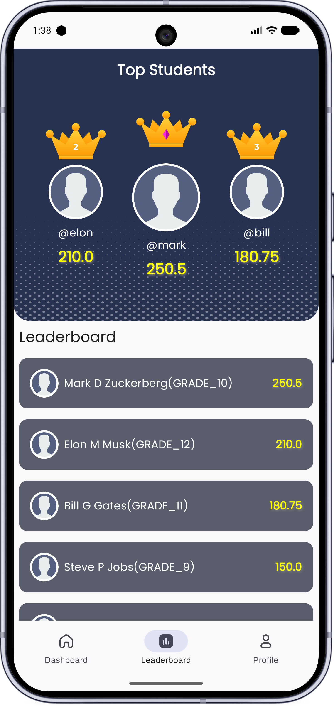
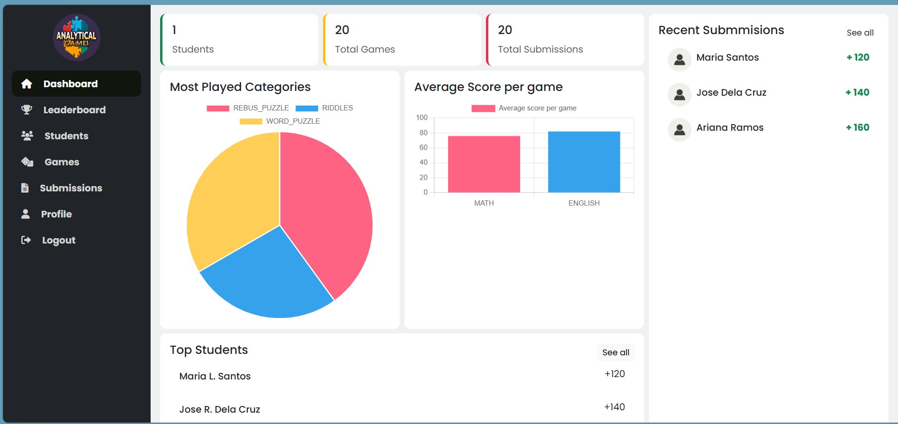

# Analytical Games

<p align="center">
  <strong>Learn. Play. Improve.</strong>
</p>

<p align="center">
  An interactive educational quiz platform designed to make learning
  engaging, competitive, and enjoyable for grade school students.
</p>

<p align="center">
  <strong>Completed in 2024</strong>
</p>

---

## About the Project

**Analytical Games** is an educational quiz and gamification platform built for **grade school students**.

The application combines interactive games, quizzes, puzzles, scoring, and leaderboards to create a more engaging learning experience. Students can practice different skills through educational games while earning points and tracking their progress.

The project consists of a **student mobile application** and a **web-based administration dashboard** for managing students, games, submissions, and monitoring platform activity.

---

## Project Overview

| | |
| --- | --- |
| **Project** | Analytical Games |
| **Type** | Educational Quiz & Gamification Platform |
| **Target Users** | Grade School Students |
| **Platforms** | Android & Web Administration |
| **Status** | Completed |
| **Year** | 2024 |

---

## Preview

### Student Application

<p align="center">
  
  &nbsp;&nbsp;
  
</p>

### Administration Dashboard

<p align="center">
  
</p>

> Screenshots and other project assets are available inside the `images` directory.

---

## Features

### 🎮 Interactive Learning Games

Students can practice different skills through educational games designed to make learning more engaging.

Game categories include:

- Quiz Games
- Memory Games
- Puzzle Games
- Math Games
- Multi-level challenges

---

### 🏠 Student Dashboard

The mobile application provides students with a simple dashboard where they can:

- Browse available games
- Explore game categories
- View their current score
- Access learning activities
- Track their progress
- Navigate between their dashboard, leaderboard, and profile

---

### 🏆 Leaderboard

Analytical Games includes a leaderboard that encourages friendly competition between students.

Students can see:

- Top-performing students
- Student rankings
- Accumulated scores
- Their progress compared with other learners

---

### 📈 Progress & Scoring

Students earn points by participating in games and completing activities.

Their accumulated scores provide a simple way to measure participation and progression throughout the platform.

---

### 🖥️ Administration Dashboard

Administrators have access to a dedicated web dashboard for managing and monitoring the platform.

The dashboard provides access to:

- Student management
- Game management
- Submission monitoring
- Leaderboard data
- Student performance
- Platform statistics
- Most-played game categories
- Average scores per game
- Recent submissions

---

## How It Works

The student experience follows a simple learning loop:

```text
Choose a Category
        ↓
Select a Game
        ↓
Complete Challenges
        ↓
Earn Points
        ↓
Track Progress
        ↓
Climb the Leaderboard
```

The goal is to combine **learning and play**, giving students immediate feedback and motivation while practicing academic and problem-solving skills.

---

## Target Users

Analytical Games was primarily designed for **grade school students** who can benefit from a more interactive approach to learning.

The platform can be used as a supplementary learning tool for:

- Students
- Teachers
- Schools
- Learning centers
- Educational programs

---

## Design Philosophy

The application was designed around three core principles.

### Simple

Students should be able to understand and navigate the application without unnecessary complexity.

### Engaging

Games, categories, scoring, and leaderboards help transform traditional learning activities into a more enjoyable experience.

### Progress-Driven

Students can see the results of their activities and are encouraged to continue learning and improving their scores.

---

## Project Structure

The repository contains both the student application and the web administration platform.

```text
Analytical-Project/
│
├── Analytical/          # Student Android application
├── analytical-web/      # Web administration dashboard
├── images/              # Screenshots and project previews
├── app-debug.apk        # Android application build
└── README.md
```

---

## Installation

Clone the repository:

```bash
git clone https://github.com/jmballangca/Analytical-Project.git
```

Navigate into the project:

```bash
cd Analytical-Project
```

The student application and administration dashboard are maintained in separate directories:

```text
Analytical/
analytical-web/
```

Refer to the configuration and dependency files inside each project directory for their respective development environment requirements.

---

## Screenshots

Additional application screenshots and project previews can be found inside:

```text
/images
```

For a cleaner repository structure, preview assets can be organized like this:

```text
images/
├── analytical-cover.png
├── home.png
├── leaderboard.png
└── admin.png
```

---

## Project Goals

Analytical Games was created to explore how **technology and gamification can make learning more interactive** for younger students.

The project focuses on:

- Making learning activities enjoyable
- Encouraging students to practice
- Providing measurable student progress
- Introducing friendly competition
- Improving student engagement
- Giving administrators visibility into student activity

---

## Future Improvements

Although the original project was completed in **2024**, possible future improvements include:

- Achievement badges and rewards
- Daily and weekly challenges
- Additional game categories
- Difficulty-based progression
- More detailed student analytics
- Teacher-specific dashboards
- Personalized learning recommendations
- Classroom competitions
- Improved accessibility


---

## Project Status

**Completed — 2024**

Analytical Games represents one of my completed educational software projects. The repository is maintained primarily as a portfolio and reference project demonstrating the development of a multi-platform educational application with student-facing and administrative experiences.

---

## Author

**jmballangca**  
Software Developer

Analytical Games was developed and completed in **2024** as an educational software project focused on making learning more interactive, engaging, and enjoyable for grade school students.

---

<p align="center">
  <strong>Analytical Games · 2024</strong>
  <br />
  <sub>Learning should be engaging, challenging, and fun.</sub>
</p>
